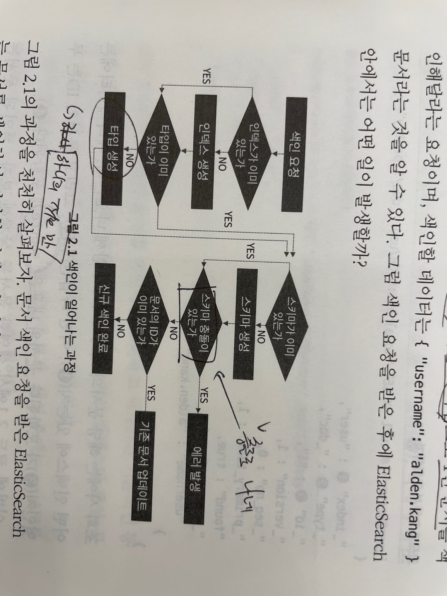

```
+++
author = "kmplex"
title = "기초부터 다지는 ES 운영노하우 1-2장"
date = "2021-04-04"
description = "Elastic Search 1-2장"
series = ["ES"]
categories = ["dev"]
+++
```

# ES 1장 훑어보기 

#### ES 특징 

- 준 실시간성 
  => 데이터 입력 시, 메모리에 저장되며, 일정 시간 후 샤드에 저장된다.
- Cluster 를 이용해 안정적인 운영 
  => 여러개의 노드로 구성되며, 데이터를 노드에 분산하여 저장한다. 
  => `keyword` primary shard / replica shard / 안정성
- RestApi 
  => restApi 로 요청하고 json 형태를 사용한다.
- schemeless
  => 동적으로 scheme 를 생성한다. 
  => `keyword` 동적 생성 / 정적 생성

# 2장 ES 기본 동작 

`그전에...`

[여기](/code/k8s)에 있는 파일을 이용하여, pod 를 띄우자.

```
kubectl create -f elastic.yml 
kubectl create -f kibana.yml 
```

> mac 에서 kubernetes starting이 오래걸리면 [여기](https://github.com/jangchulwoon/TIL/pull/7) 참고
 
#### 문서 색인 및 조회


앞서 설명했듯, ES 는 schemeless 이므로, scheme를 미리 정의하지 않아도 된다.
별도의 스키마 생성 없이, 아래처럼 바로 index 를 생성할 수 있다.

- 색인

```
# input 

curl -X PUT "http://kubernetes.docker.internal:30482/user/_doc/1?pretty" -H 'Content-Type: application/json' -d '{ "username" : "lusiue" }'

# output
{
  "_index" : "user",
  "_type" : "_doc",
  "_id" : "1",
  "_version" : 1,
  "result" : "created", # 생성되었다는 의미 / 수정시 updated 로 전달 
  "_shards" : {
    "total" : 2,
    "successful" : 1,
    "failed" : 0
  },
  "_seq_no" : 0,
  "_primary_term" : 1
}
```

방금 입력한 url 을 하나씩 분석해보자.

`curl -X PUT http://kubernetes.docker.internal:30482/user/_doc/1?pretty`

- 1. 문서를 새로 입력 할 땐, PUT `HTTP METHOD` 을 사용한다.
- 2. user는 색인할 인덱스를 의미한다.  => 인덱스란 문서를 저장하는 논리적 단위이다. 
- 3. _doc 은 문서의 타입이다.
- 4. 1 은 색인할 문서의 ID 이다. => 같은 ID 가 입력될 경우, 수정한다고 인식한다.




> 색인이 일어나는 과정 

*주의* 동일한 인덱스 / 타입 안에서 이미 정의된 필드가 있을 경우, 다른 형태의 값이 들어오면 충돌을 일으킨다.
schemeless가 타입이 없는걸 의미하진 않는다.

- 조회 

```
#input 
curl -X GET "http://kubernetes.docker.internal:30482/user/_doc/1?pretty"

# output 
{
  "_index" : "user", # 인덱스 이름 
  "_type" : "_doc", # type 
  "_id" : "1",
  "_version" : 1, # version
  "_seq_no" : 0,
  "_primary_term" : 1,
  "found" : true,
  "_source" : { # 입력한 데이터
    "username" : "lusiue"
  }
}
```

조회 시, index의 meta 데이터도 함께 내려온다. 
주요 설명은 output 에 주석으로 남겨두었으며 나머지 meta 데이터는 뒷장에서 서술한다.

- 문서 삭제 

```
curl -X DELETE "http://kubernetes.docker.internal:30482/user/_doc/1?pretty"

# output 
{
  "_index" : "user",
  "_type" : "_doc",
  "_id" : "1",
  "_version" : 2,
  "result" : "deleted",
  "_shards" : {
    "total" : 2,
    "successful" : 1,
    "failed" : 0
  },
  "_seq_no" : 1,
  "_primary_term" : 1
}
```

응답의 result property 로 처리 여부를 알 수 있다. 이때 삭제한 문서를 조회하면 다음과 같은 결과가 나온다.

```
curl -X GET "http://kubernetes.docker.internal:30482/user/_doc/1?pretty"

{
  "_index" : "user",
  "_type" : "_doc",
  "_id" : "1",
  "found" : false
}
```

### index 생성 / 확인

위 과정을 조금 더 풀어서 한단계씩 다시 진행한다.

> 1. index 생성

```
curl -X PUT "http://kubernetes.docker.internal:30482/contents?pretty"
```

위처럼 type / ID 를 명시하지 않고 index 를 생성할 수 있으며 아래 cat API 를 통해 index 목록을 확인할 수 있다.

```
curl -s "http://kubernetes.docker.internal:30482/_cat/indices?v"
```

> 2. index 색인

```
curl -X PUT "http://kubernetes.docker.internal:30482/contents/_doc/1?pretty" -H 'Content-Type: application/json' -d '{ "title": "How to use ElasticSearch", "author": "alden.kang"}'
```

> 3. index 수정 

```
curl -X PUT "http://kubernetes.docker.internal:30482/contents/_doc/1?pretty" -H 'Content-Type: application/json' -d '{ "title": "How to use ElasticSearch", "author": "alden.kang, benjamin.butn"}'

#output 
{
  "_index" : "contents",
  "_type" : "_doc",
  "_id" : "1",
  "_version" : 3, # 수정한 버전 
  "result" : "updated", # 수정 
  "_shards" : {
    "total" : 2,
    "successful" : 1,
    "failed" : 0
  },
  "_seq_no" : 2,
  "_primary_term" : 1
}
```

동일한 ID 로 PUT 요청을 하면 update 로 인식하고, 문서를 수정한다.

> 4.  mapping 확인

```
 curl -s "http://kubernetes.docker.internal:30482/_mappings?pretty"

 #output 
 "contents" : {
    "mappings" : {
      "properties" : {
        "author" : {
          "type" : "text",
          "fields" : {
            "keyword" : {
              "type" : "keyword",
              "ignore_above" : 256
            }
          }
        },
        "title" : {
          "type" : "text",
          "fields" : {
            "keyword" : {
              "type" : "keyword",
              "ignore_above" : 256
            }
          }
        }
      }
    }
  }
```

property의 자세한 설명은 뒷 챕터에서 진행한다.

> 5. 새로운 필드 추가 

```
curl -X PUT "http://kubernetes.docker.internal:30482/contents/_doc/1?pretty" -H 'Content-Type: application/json' -d '{ "title": "How to use ElasticSearch", "author": "alden.kang, benjamin.butn", "rating": 5.0}'

# output 
{
  "_index" : "contents",
  "_type" : "_doc",
  "_id" : "1",
  "_version" : 4,
  "result" : "updated",
  "_shards" : {
    "total" : 2,
    "successful" : 1,
    "failed" : 0
  },
  "_seq_no" : 3,
  "_primary_term" : 1
}
```

기존에  있던 title / author 외에 rating 이라는 신규 필드를 추가했다.
PUT 요청을 사용하여 필드를 추가했으며, 동적으로 스키마에 추가된다.

위 예시에서 알 수 있 듯 기존에 스키마가 있다해도, 새로운 필드가 추가되면 동적으로 필드가 색인되고 스카마가 변경된다.

> 6. 스키마 충돌 

만약 기존에 정의된 스키마에 다른 타입의 값을 넣으면 어떻게 될까 ?

```
curl -X PUT "http://kubernetes.docker.internal:30482/contents/_doc/2?pretty" -H 'Content-Type: application/json' -d '{ "title": "How to use ElasticSearch", "author": "alden.kang, benjamin.butn", "rating": "A"}'
#output
{
  "error" : {
    "root_cause" : [
      {
        "type" : "mapper_parsing_exception",
        "reason" : "failed to parse field [rating] of type [float] in document with id '2'. Preview of field's value: 'A'"
      }
    ],
    "type" : "mapper_parsing_exception",
    "reason" : "failed to parse field [rating] of type [float] in document with id '2'. Preview of field's value: 'A'",
    "caused_by" : {
      "type" : "number_format_exception",
      "reason" : "For input string: \"A\""
    }
  },
  "status" : 400
}
```

float type 에 string 값을 넣을 경우, 스키마 충돌이 발생하며 입력되지 않는다.
ES 에서 말하는 schemeless 는 스키마가 없다는 의미가 아닌, 동적 스키마으로 생성이 가능하다는 의미이다.

### 문서 검색하기

```
curl -X GET "http://kubernetes.docker.internal:30482/contents/_doc/_search?q=*&pretty"
#output
{
  "took" : 75, # 검색 소요 시간 ms 
  "timed_out" : false,
  "_shards" : {
    "total" : 1,
    "successful" : 1,
    "skipped" : 0,
    "failed" : 0
  },
  "hits" : {
    "total" : {
      "value" : 2,
      "relation" : "eq"
    },
    "max_score" : 1.0,
    "hits" : [
      {
        "_index" : "contents",
        "_type" : "_doc",
        "_id" : "1",
        "_score" : 1.0,
        "_source" : {
          "title" : "How to use ElasticSearch",
          "author" : "alden.kang, benjamin.butn",
          "rating" : 5.0
        }
      },
      {
        "_index" : "contents",
        "_type" : "_doc",
        "_id" : "2",
        "_score" : 1.0,
        "_source" : {
          "title" : "How to use ElasticSearch",
          "author" : "alden.kang, benjamin.butn",
          "rating" : "5.0"
        }
      }
    ]
  }
}
```

`_search` API에 query parameter를 활용하여 data 를 검색 할 수 있다.
검색 방식에 대한 자세한 설명은 뒷장에서 이어진다.

### 데이터 분석하기

위에서 설명한 검색 작업을 바탕으로, 통계를 만들어 낼 수 있다.

```
curl -X GET "http://kubernetes.docker.internal:30482/contents/_doc/_search?q=*&pretty" -H 'Content-Type: application/json' -d '{"size":0, "aggs":{"group_by_stat" : { "terms": {"field": "author.keyword"} }}}'
```

분석작업은 경우에따라 많은 양의 메모리(힙)을 사용하는데, 키바나등을 사용할 땐, 주의해야한다.

> 검색 기간을 많이 잡을 경우, ES 클러스터 전체가 응답 불가에 빠질 수 있다.

이 역시 자세한 사용법은 뒷장에서 이어진다.


### 요약 

이번 장에선 아래 내용을 다뤘다.

- 문서를 색인하는 방법  (index 생성 / 문서 생성 / 수정 / 삭제)
- 문서를 조회하는 방법
- ES 문서 생성시 lifecycle
