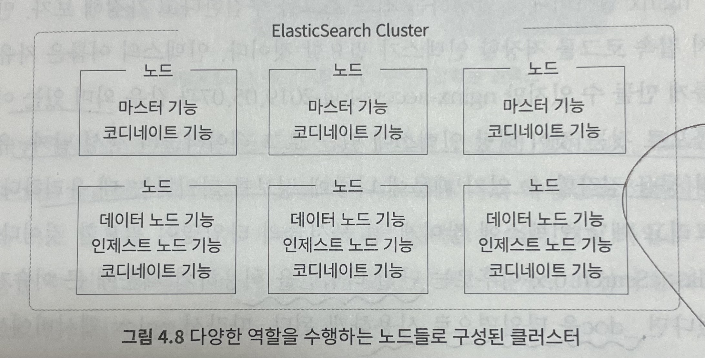
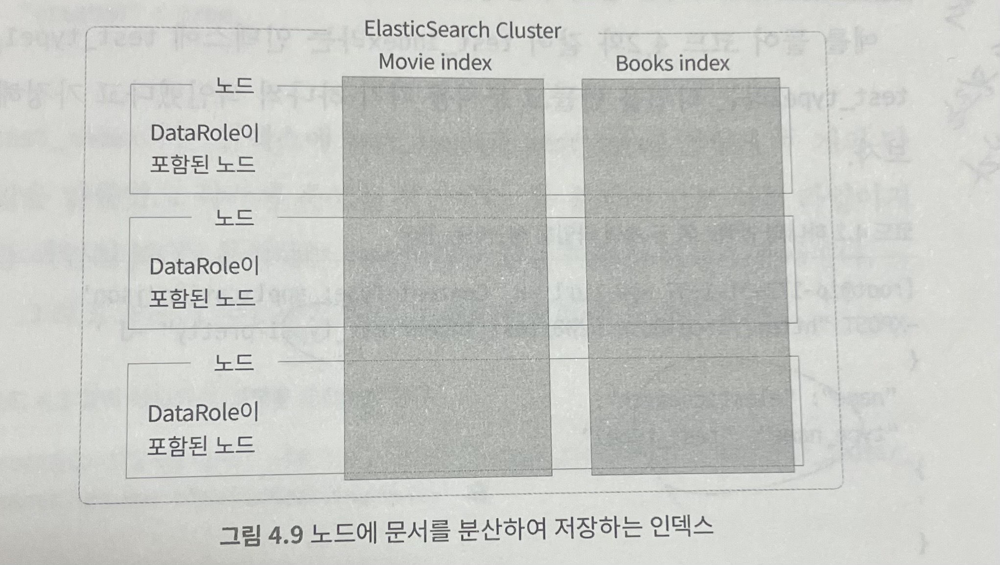
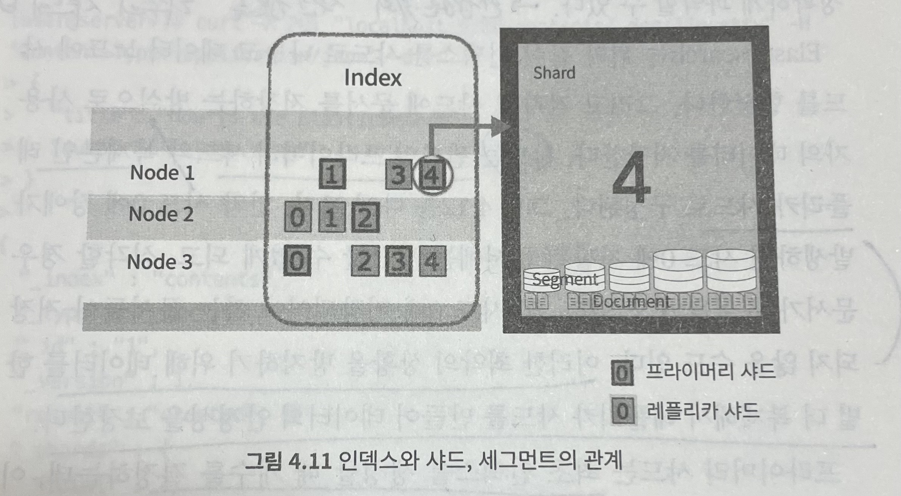
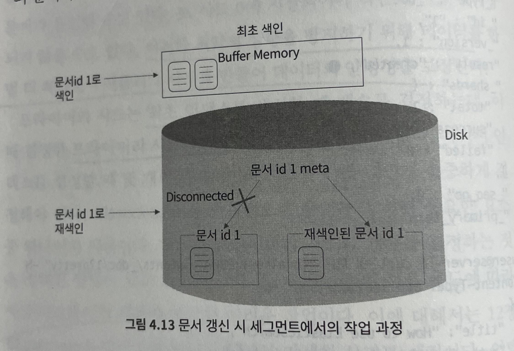
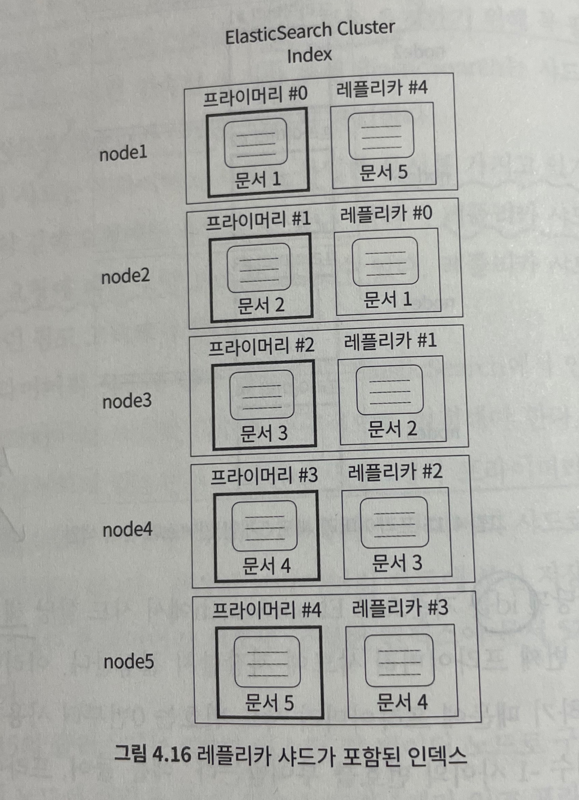

```
+++
author = "kmplex"
title = "기초부터 다지는 ES 운영노하우 4장"
date = "2022-03-29"
description = "Elastic Search 4장"
series = ["ES"]
categories = ["dev"]
+++
```

# ElasticSearch 기본 개념

## Cluster와 Node의 개념

`클러스터`란 여러 대의 구성 요소들을 논리적으로 결합하여 전체를 하나의 구성 요소처럼 사용 할 수 있게 해주는 기술이다. ES 클러스터 역시, 여러 개의 ES 프로세스들을 논리적으로 결합하여, 하나의 프로세스처럼
사용 할 수 있게 해준다. 이때 클러스터를 구성하는 ES 프로세스를 `노드` 라고 부른다.

복수개의 노드가 하나의 ES 처럼 동작하기 때문에, 어느 노드에 API를 요청해도 동일한 응답 / 동작을 보장받을 수 있다. 다수의 노드로 클러스터를 구성하면, 하나의 노드에 장애가 발생해도 요청을 처리할 수 있게
되어, 높은 안정성을 보장 할 수 있다.

> ES 클러스터를 하나의 노드로 구성할 수 있으나, 안정성을 이유로 권장하지 않는다.

```text
GET /

# response
{
  "name" : "a8f7d982c3e3",
  "cluster_name" : "docker-cluster",
  "cluster_uuid" : "G1PHDx2rQ1CZyIeGfl9b_A",
  "version" : {
    "number" : "8.1.1",
    "build_flavor" : "default",
    "build_type" : "docker",
    "build_hash" : "d0925dd6f22e07b935750420a3155db6e5c58381",
    "build_date" : "2022-03-17T22:01:32.658689558Z",
    "build_snapshot" : false,
    "lucene_version" : "9.0.0",
    "minimum_wi re_compatibility_version" : "7.17.0",
    "minimum_index_compatibility_version" : "7.0.0"
  },
  "tagline" : "You Know, for Search"
}
```

- `name` 은 요청을 처리한 노드의 이름이다.
    - 복수개로 노드가 구성되어 있다면, 이 값은 달라질 수 있다.
- `cluster_name` 클러스터의 이름으로, 같은 클러스터에 속한 노드들은 동일한 이름을 갖는다.
- `cluster_uuid` 이 값 역시, 클러스터에 속한 모든 노드가 동일한 값을 갖는다.
    - 클러스터가 최초 생성될 때, 자동으로 생성되는 값으로 사용자가 지정하진 않는다.

앞서 이야기한 것처럼 노드는 클러스터를 구성하는 논리적인 ES 프로세스 하나를 의미한다. 클러스터와 마찬가지로 각각의 고유한 노드 이름과 UUID 가 있고, 역할에 따라 여러 가지 노드로 구분할 수 있다.

|노드 역할| 설명                                           |
|---|----------------------------------------------|
|마스터| 클러스터 구성에서 중심이 되는 노드. 클러스터의 상태등 메타 데이터를 관리한다. |
|데이터| 문서를 실제로 저장하는 노드                              |
|인제스트| 문서 저장 전, 문서 내용을 사전 처리하는 노드                   |
|코디네이트| 사용자의 요청을 데이터 노드로 전달하고, 다시 결과를 취합하는 노드        |

노드가 할 수 있는 역할은 총 4가지로, 한 번에 여러 개의 역할을 할 수 있다.

- `마스터 노드`는 클러스터의 메타데이터를 관리하는 역할로, 한대 이상으로 구성되어야한다.
  - 클러스터 내의 모든 노드는 현재노드의 상태, 성능 정보, 샤드의 정보를 마스터 노드에게 알린다.
  - 마스터 노드는 이러한 정보를 수집 / 관리하면서 클러스터의 안정성을 확보하기 위해 필요한 작업들을 진행한다.
- `데이터 노드`는 사용자가 색인한 문서를 저장하고, 검색 요청을 처리해서 결과를 돌려주는 역할을 한다.
  - 자신이 받은 요청 중, 처리할 수 있는 요청은 직접 처리하고, 다른 데이터 노드들이 처리해야할 요청은 전달한다.
  - 어떤 데이터 노드로 요청을 전달 할 것인지는 `마스터 노드`를 통해 받은 클러스터의 전체 상태 정보를 바탕으로한다.
- `인제스트 노드`는 사용자가 색인하길 원하는 문서의 내용 중, 변환이 필요한 부분을 사전에 처리한다.
  - 데이터 노드에 저장하기 전에 특정 필드의 값을 가공해야 할 경우, 유용하게 동작한다.
- `코디네이트`는 실제 데이터를 저장하거나 처리하진 않지만, 사용자의 색인이나 검색 등 모든 요청을 데이터 노드에 전달한다.
  - 문서를 저장하지 않는 데이터 노드라고도 생각 할 수 있다.

마스터 노드는 한 대이지만, 마스터 역할이 가능한 노드는 여러 대 일 수 있다.

> 클러스터 구성 시 3대의 마스터 노드를 구성한다면, 그중 한 대만 실제 메타데이터를 관리하고, 나머지 두 대는 장애 발생 시 새로운 마스터가 될 수 있는 후보 노드로 관리된다.

마스터 후보 노드들은 마스터 노드로부터 지속적으로 클러스터 운영에 필요한 데이터를 전달 받기때문에, 마스터 노드에 장애가 발생해도 중단 없이 서비스를 이어 갈 수 있다.



또한 각각 노드들은 하나 이상의 역할을 수행할 수 있다. 운영 시엔 각각의 노드 개수를 결정하여 클러스터를 구성해야한다.

## 인덱스와 타입

`인덱스`란 사용자의 데이터가 저장되는 논리적인 공간을 의미하며, 타입은 인덱스 안의 데이터를 유형별로 나눠 놓은 공간을 의미한다.

RDBMS 와 비교 시, 인덱스를 DB 로, 타입을 Table 로 표현하기도 한다.
다만 ES 6.x 버전 이후로는 하나의 인덱스에 하나의 타입만을 갖을 수 있어, 위 표현이 완벽히 일치하진 않는다.

> 6.x 이후로는 단일 타입만을 허용하기에 큰 이슈가 없다면 _doc 을 타입명으로 사용하게 된다.

인덱스의 이름은 `${name}.date` 와 같은 형태로 구성되며, 클러스터 내에서 유일해야한다. 또한 저장된 문서들은 데이터 노드에 `분산 저장` 된다.




`멀티 타입에 대하여..`

과거 5.x 까지는 하나의 인덱스에 여러개의 타입을 사용할 수 있었다.
왜 6.x 부터는 멀티 타입을 지원하지 않을까 ? 그 이유 중 하나는 인덱스에 존재하는 서로 다른 타입에서 동일한 이름의 JSON 문서 필드를 만들 수 있어서,
의도치 않은 검색 결과가 나타나는 문제가 발생했기 때문이다.

예를 들어, `test_index` 라는 인덱스에 `test_type1` / `test_type2` 라는 타입을 만들고 각각 문서를 색인했다고 가정해보자.

```text
POST /test_index/test_type1 
{
  "name" : "elasticsearch",
  "type_name" : "test_type1"
}

POST /test_index/test_type2 
{
  "name" : "elasticsearch",
  "type_name" : "test_type2"
}
```

두 문서는 서로 다른 타입이지만, 색인된 문서에는 name 이라는 같은 이름의 필드가 존재한다.
이 상황에서 아래처럼 검색 요청을 보낼 경우, 

```text
GET /test_index/_search?q=name:elasticsearch&pretty
```

양 쪽 타입에 name 이라는 필드가 있어서 의도하지 않은 타입에서 문서가 검색되는 것을 볼 수 있다.
이러한 문제 때문에 6.x 부터는 하나의 인덱스에 하나의 타입만 지원하게되었다.

> _doc 이라는 이름으로 타입을 사용하도록 권고하며, 이후엔 고정될 예정이다. 다만, 5.x 버전에서는 _ 를 사용하여 타입을 지정할 수 없다. 

만약 5.x 에서 버전 업그레이드를 고려하고 있다면, 이러한 사항들을 고려해야한다.

## 샤드와 세그먼트 

샤드는 인덱스에 색인되는 문서들이 저장되는 `논리적인 공간` 을 의미하며, 세그먼트는 샤드의 데이터들을 가지고 있는 `물리적인 파일` 을 의미한다.



인덱스는 다수의 샤드로 구성되고, 하나의 샤드는 다수의 세그먼트로 구성된다.
샤드는 1개 이상의 세그먼트로 구성되는데, 샤드마다 세그먼트의 수가 서로 다를 수 있다.

위 같은 구조로, 만약 2번샤드에 문제가 생길경우 일부 문서만 검색 / 색인이 안되며, 다른 데이터들은 정상적으로 처리된다.

> 위 개념을 이해하면, 장애 발생 시 규모를 정확하게 파악할 수 있다.

ES는 위와 같이 인덱스를 샤드로 나누고 데이터 노드에 샤드를 할당한다. 그리고 각각의 샤드에 문서를 저장하는 방식으로 사용자의 데이터를 저장한다.
샤드는 `프라이머리 샤드` / `레플리카 샤드`로 구성되는데, 장애 발생 시, 데이터의 안정성을 위해 복제본을 구성한다.

프라이머리 샤드는 최초 인덱스 생성 시, 개수를 결정하는데 이후 프라이머리 샤드의 수를 변경 할 수 없다. 

> index 색인 시, 저장되는 샤드를 hash 함수로 결정하기에 프라이머리 샤드 수를 변경 시 이미 저장된 문서를 못찾게된다.

따라서 최초 인덱스 생성 시, 몇 개의 프라이머리 샤드를 만들 것인지 신중하게 결정해야한다.

인덱스에 저장되는 문서는 hash Algorithm 을 통해 샤드에 할당괴고, 실제는 세그먼트라는 물리적 파일에 저장된다. 
다만, 바로 저장되는 것은 아니고, 색인된 문서는 먼저 메모리 버퍼 캐시에 저장 후, refresh 과정을 거쳐 저장된다.

> 10장에서 조금더 자세히 다룬다.

세그먼트는 불변의 특성을 갖는데, 이미 저장된 데이터에 대해서는 업데이트 처리를 하지 않는다.
문서의 update 는 기존 데이터를 변경하는 과정이 아닌, `신규 데이터 입력 후 불용 처리` 과정이다.



위 과정은 delete 도 마찬가지인데, 이 특성으로 ES는 데이터의 일관성을 유지할 수 있다.
다만, 불용 처리한 데이터들이 많이 질 수록 세그먼트의 크기가 커지는데, 이러한 단점을 보완하기 위해, ES 백그라운드에서는 세그먼트 병합을 진행한다.

이러한 세그먼트 병합 작업으로 백그라운드에서 여러 개의 작은 세그먼트들을 하나의 큰 세그먼트로 합치는 작업이 무수히 일어난다. 
그리고 병합시에 불용 처리한 데이터들이 디스크에서 삭제된다.

이렇게 병합과정으로, 검색 요청 시 접근해야하는 파일의 개수가 줄어 사용자의 요청에 그만큼 적은 비용으로 빠르게 응답할 수 있다.

## 프라이머리 샤드와 레플리카 샤드

ES 는 서비스의 연속성을 위해 샤드를 프라이머리 / 레플리카로 나눠서 관리한다.

> 장애 상황에서도 데이터가 유실되지 않도록 관리하기 위해 => 서비스의 연속성 

레플리카 샤드는 프라이머리 샤드와 동일한 문서를 가지고 있기 때문에, 사용자의 검색 요청에도 응답할 수 있다.
따라서 레플리카 샤드를 늘리면 검색 요청에 대한 응답 속도를 높일 수 있다.

`프라이머리 샤드`

6.x 버전 까진 5개의 프라이머리 샤드가 기본으로 설정된다.
문서를 색인할때, 어떤 프라이머리 샤드로 들어갈지는 아래 Algorithm 을 따른다.

```text
샤드 번호 = hash (문서의 id) % 샤드 개수
```

이러한 로직때문에 인덱스 생성 후에는 프라이머리 샤드의 개수를 변경 할 수 없다.

> 프라이머리 샤드가 바뀌려면, 지금까지 저장된 문서들의 샤드 번호가 모두 변경되어야한다.

만약 프라이머리 샤드가 포함된 노드 장애가 발생 시, 레플리카 샤드로 대체되는데, 레플리카 샤드는 프라이머리 샤드와 다른 노드에서 관리된다.



장애가 발생하면, 레플리카 샤드가 프라이머리 샤드로 승격되며, 다른 노드에 레플리카 샤드를 새로 생성한다.

```text
1번 노드에 장애가 발생하면,

1. 레플리카 #0 이 프라이머리로 승급되며,  
2. 레플리카 #0 은 다른 노드에 새롭게 생성된다.
3. 또한 레플리카 #4 를 다른 노드에 생성한다. 
```

사용자의 별도 설정이 없다면, 프라이머리 샤드당 하나의 레플리카 샤드를 만드는 것이 기본 설정이다. 

```text
# shard 설정 값과 함께 index 생성
PUT /shard_index
{
  "settings": {
      "number_of_shards" : 3,
      "number_of_replicas" : 2
  }
}

# 설정 조회

GET /shard_index/_settings

{
  "shard_index" : {
    "settings" : {
      "index" : {
        "routing" : {
          "allocation" : {
            "include" : {
              "_tier_preference" : "data_content"
            }
          }
        },
        "number_of_shards" : "3",
        "provided_name" : "shard_index",
        "creation_date" : "1648810263576",
        "number_of_replicas" : "2",
        "uuid" : "d1trAxjbTP6TbUVcP6e_gg",
        "version" : {
          "created" : "8010199"
        }
      }
    }
  }
}
```

만약 primary shard 를 설정한 상태에서 다시 수정하려고 하면 exception 이 발생한다.

```text
PUT /shard_index/_settings
{
  "index.number_of_shards" : 4
}

{
  "error" : {
    "root_cause" : [
      {
        "type" : "illegal_argument_exception",
        "reason" : "Can't update non dynamic settings [[index.number_of_shards]] for open indices [[shard_index/d1trAxjbTP6TbUVcP6e_gg]]"
      }
    ],
    "type" : "illegal_argument_exception",
    "reason" : "Can't update non dynamic settings [[index.number_of_shards]] for open indices [[shard_index/d1trAxjbTP6TbUVcP6e_gg]]"
  },
  "status" : 400
}
```

프라이머리 샤드와 달리, 레플리카 샤드는 언제든 변경할 수 있다.
정리하자면, 인덱스는 여러개의 샤드로 구성되어 있고, 샤드는 클러스터를 구성하는 노드들에 분산되어 있다.
그리고 각 샤드는 세그먼트로 구성되어 잇으며, 세그먼트 안에 각각의 문서들이 저장되어 있다.
세그먼트들은 시간이 지남에 따라, 늘어나는 작은 크기의 세그먼트를 병합하면서 증가 / 감소를 반복한다.

## 매핑 

매핑은 RDBMS 의 스카마와 유사한 것으로, Json 문서들이 어떤 키 / 값을 가지고 있는지 정의한 것이다.


```text
GET /user/_mapping

{
  "user" : {
    "mappings" : {
      "properties" : {
        "username" : {
          "type" : "text",
          "fields" : {
            "keyword" : {
              "type" : "keyword",
              "ignore_above" : 256
            }
          }
        }
      }
    }
  }
}
```

매핑 정보는 미리 정의해도 되고 미리 정의하지 않아도 되는데, 미리 정의하고 사용하는 것을 정적 매핑이라하며,
정의하지 않고 사용하는 것을 동적 매핑이라 부른다.

동적매핑은 최초 색인된 문서를 바탕으로 ES 가 자동으로 매핑을 생성해주는 방식으로 높은 편의성을 제공한다.

> 10 장에서 이 둘의 차이를 살펴볼 것이다.

일단 매핑이 시작되면, 이후 생성되는 문서는 기존 매핑정보에 따라 색인되어야한다.

> 타입이 다를 경우 conflict 가 발생한다.

