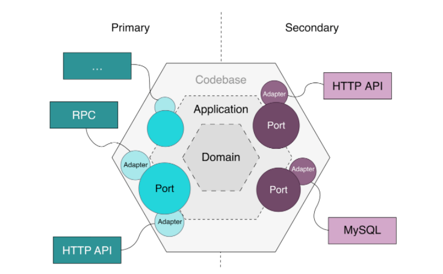

```
+++ 
author = "kmplex" 
title = "unit testing 5장" 
date = "2022-01-15" 
description = "unit testing 2부 5장"  
series = ["unit testing"] 
categories = ["dev","test"] 
+++
```

[Unit Testing](http://www.yes24.com/Product/Goods/104084175)를 읽고 짤게 정리한 내용입니다.

## 2부 개발자에게 도움이 되는 테스트 만들기 

## 5장. 목과 테스트 취약성

#### 1. 테스트 대역의 유형

테스트 대역(`Test Double`) 은 모든 유형의 가짜 의존성 을 설명하는 포괄적인 용어로, 테스트를 편리하게 하기 위하여 사용된다.
테스트 대역에는 더미 , 스텁, 스파이, 목, 페이크 라는 다섯가지 종류가 있으나, 크게 목 / 스텁 두가지 유형으로 나눌 수 있다.

> 다섯 가지 변형의 차이점은 미미한 구현 세부사항이다.

`목`은 외부로 나가는 상호작용을 모방하고, 검사하는 데 도움이 된다. (SUT 가 상태를 변경하기 위한 위존성 호출)
`스텁`은 내부로 들어오는 상호 작용을 모방하는 데 도움이 된다. (SUT 가 입력 데이터를 얻기 위한 의존성 호출)

#### 2. 스텁으로 상호 작용을 검증하지 마라 

목과 스텁의 차이는 상호 작용을 검증하지 말라는 지침에서 비롯된다.
테스트에서 `거짓 양성`을 피하고, 리팩터링 내성을 향상 시키는 방법은 구현 세부 사항이 아니라, 최종 결과를 검증하는 것 뿐이다.

> stub 으로 처리한 객체에 대하여, mock 으로 호출 여부를 검증하지 마라 

최종 결과가 아닌 사항을 검증하는 관행을 `과잉 명세` 라고 부른다.

#### 3. CQS 와 Mock / Stub

목과 스텁의 개념은 명령 조회 분리 원칙과 관련이 있다.
CQS 원칙에 따르면 모든 메서드는 명령이거나 조회여야 하며, 그 둘을 혼용해서는 안된다.

`Command` -> Mock
`Query` -> Stub (멱등성 보장)

> pop 같은 함수가 있기 때문에 모든 상황에서 CQS 를 따를 순 없음

#### 3.1 식별할 수 있는 동작과 구현 세부 사항

`거짓 양성`이 있는 주요 원인은 코드의 구현 세부 사항과 결합돼 있기 때문이였다.
이러한 강결합을 피하는 방법은 코드가 생성하는 최종 결과를 검증하고, 구현 세부 사항과 테스트를 가능한 떨어뜨리는 것뿐이다.

> How 보다 What 을 더 중요시 해야한다. (묻지말고 말하라)

그렇다면, 구현 세부 사항은 무엇이며, 식별할 수 있는 동작과 어떻게 다른가 ??

#### 3.2 식별할 수 있는 동작은 공개 API와 다르다.

`식별할 수 있는 동작`과 `구현 세부 사항`은 겹치지 않는 속성으로, 코드가 시스템의 식별 할 수 있는 동작이려면, 다음 중 하나를 해야한다.

```text
1. 클라이언트가 목표를 달성하는데 도움이 되는 연산을 노출하라.
2. 클라이언트가 목표를 달성하는데 도움이 되는 상태를 노출하라.
```

> 구현 세부 사항은 이 두가지중 아무것도 하지 않는다.

코드가 식별 할 수 있는 동작인지의 여부는 해당 클라이언트가 누구인지 / 클라이언트의 `목표`가 무엇인지에 달려있다.
식별할 수 있는 동작이 되려면, 코드가 이러한 목표 중 하나에라도 직접적인 관계가 있어야한다.

> 클라이언트는 코드가 있는 위치에 따라 다른 것을 의미할 수 있다.

이상적으로는 공개 API 는 식별할 수 있는 동작과 일치해야하며, 모든 구현 세부 사항은 클라이언트 눈에 보여선 안된다.

#### 3.3 잘 설계된 API 와 캡슐화

캡슐화는 궁극적으로 단위 테스트와 동일한 목표를 달성한다. 
구현 세부사항을 숨겨, 테스트가 대상 클래스에게 결합되지 않도록 단위 테스트를 작성하라.

#### 4. Mock 과 테스트 위약성 간의 관계 
#### 4.1 육각형 아키텍처 정의

전형적인 Application 은 Domain / Application Service 라는 두 계층으로 구성된다.
Domain 계층은 application 의 중심부 이기에, 도표의 중앙에 위치하며, 핵심 비즈니스 로직이 포함되어 있다.




Application 계층은 Domain 계층 위에 있으며, 외부 환경과의 통신을 조정한다.  즉, Domain 과 외부 의존성 간의 작업을 조정한다.
application 과 domain 계층의 조합은 육각형을 형성하며, application 을 형성한다. 또한 다른 application 과 소통할 수 있고, 이또한  육각형으로 나타낸다.

> 육각형이라고 해서, 의존이 6개라는 의미는 아니다. 요점은 연결이 많다는 것이다.

Hexagonal architecture 의 주요 목적은 아래와 같다.

```text
1. domain 계층과 application service 계층간의 관심사 분리
2. application 내부 통신 
application 계층은 domain 계층을 바라보며, domain 계층은 application 계층에 의존되어서는 안된다. (단방향 의존성을 설정함)
domain 계층을 외부 환경에서 완전히 격리시킨다.

3. application 간의 통신 
외부 application 은 직접 domain 을 참조할 수 없으며, application 계층을 통해서만 연결된다.
```

각 Application 계층은 식별할 수 있는 동작을 나타내며, 구현 세부 사항을 포함하고 있다. Domain 계층은 Application 의 목표를 달성하는데 도움이 되는 상태 / 연산을 제공한다.
잘 설계된 API 원칙에는 프랙탈 특성이 나타난다. `전체 계층의 목표와 하위 계층의 목표가 똑같이 적용된다.`

> 일부 작은 조각이 전체와 비슷한 기하학적 형태를 의미
> 식별 할 수 있는 동작은 바깥에서 안쪽으로 흐르는데, 외부 클라이언트에게 중요한 목표는 개별 도메인 클래스에서 달성한 하위 목표로 변환된다.

API를 잘 설계하면 Test 에서도 프랙탈 구조를 갖기 시작하는데, 하나의 목표를 위해, 서로 다른 수준의 동작을 검증하는 형태를 띈다.

`Application layer Test` 해당 서비스가 외부 클라이언트에게 `큰 목표`를 제공하는지 검증
`Domain Layer Test` 큰 목표를 달성 하기 위한 하위 목표를 검증

즉, 각 테스트는 큰 목표를 달성하기 위한 작은 목표들을 검증해야하며, 그렇지 않으면 구현 세부사항과 결합되어 있다는 의미이다.

> 책에서는 도메인 전문에게 의미있는 이야기를 전달해야한다고 말한다. 


#### 4.2 모든 프로세스 외부 의존성을 목으로 해야하는 것은 아니다.

> 책에서 시스템 외부 통신 / 시스템 내부 통신에 대한 이야기를 하지만, 생략 

고전파는 시스템 외부 통신 (api간 통신)을 mock 으로 처리하라 권장하지만, 이또한 지나치다.

DB 와 같은 외부 의존성이 application 을 통해서만 접근할 수 있으면, 식별할 수 있는 동작이 아니며, 이또한 application 의 일부로 작용한다.

> DB 또한 구현 세부사항으로 인지한다. (6/7장에서 좀더 자세히 설명)

mock 은 application 의 경계를 넘나드는 상호 작용을 검증할때와, 상호작용의 부작용이 외부 환경에서 보일때만 사용해야한다.

> 내부 application (DB 등의 저장소) 호출은 mock을 사용하지 않아도 괜찮다 라는 말을 하고 싶은 듯함
