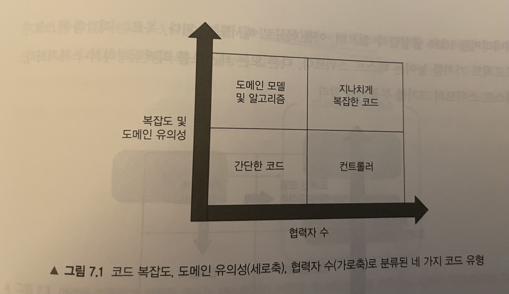
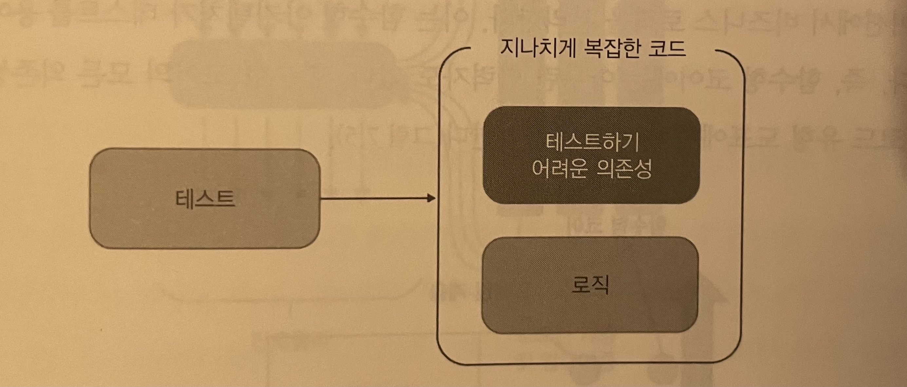
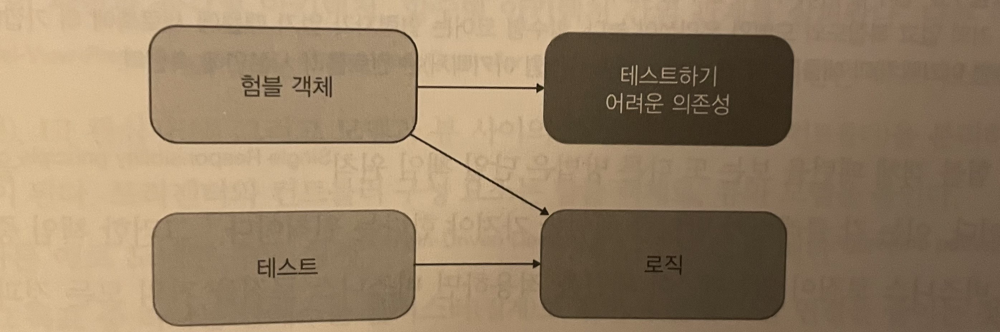
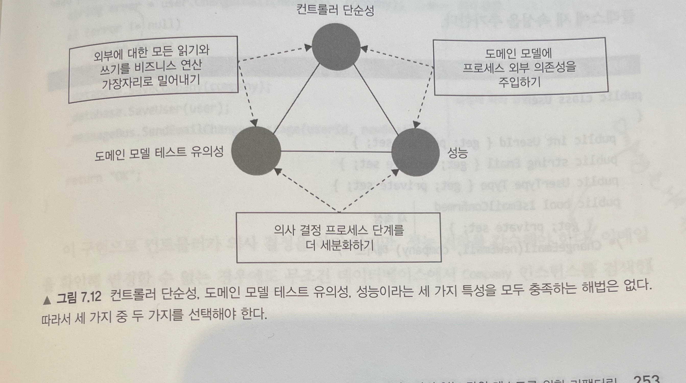

```
+++ 
author = "kmplex" 
title = "unit testing 7장" 
date = "2022-02-03" 
description = "unit testing 2부 7장"  
series = ["unit testing"] 
categories = ["dev","test"] 
+++
```

[Unit Testing](http://www.yes24.com/Product/Goods/104084175)를 읽고 짤게 정리한 내용입니다.

## 2부 개발자에게 도움이 되는 테스트 만들기 

## 7장. 가치 있는 단위 테스트를 위한 리팩터링 

#### 리팩터링할 코드 식별하기

테스트 코드와 제품 코드는 본질 적으로 관련되어 있기에, 기반 코드를 리팩터링하지 않고서는, 테스트 스위트를 크게 개선할 수 없다.
이번 절에서는 리팩터링 방향을 설명하고자, 코드를 네 가지 유형으로 분류하는 방법을 소개한다.

제품 코드는 2차원으로 분류할 수 있다.

- 복잡도 / 도메인 유의성
- 협력자 수

복잡도는 `1 + 분기점 수` 로 계산된다.
도메인 유의성은 코드가 도메인에 얼마나 의미있는가를 나타낸다.
도메인 계층의 코드는 유의성이 높으나, 유틸리티 코드는 유의하지 않다.

복잡한 코드와 도메인 유의성을 갖는 코드는 회귀 방지에 뛰어나기에, 단위 테스트에서 가장 이롭다.

> `복잡한 코드`는 도메인 유의성이 없더라도 테스트 할만하며, 도메인 코드는 복잡하지 않아도, 테스트 할 만하다. 
    
이 두 지표는 독립적으로, 복잡도가 낮으나, 도메인에 중요한 로직이라면 테스트가 중요해진다.

> 둘 중 하나의 지표라도 높다면, 테스트 할만 하다.

협력자 수는 가변 의존성이나 프로세스 외부 의존성을 의미한다.
협력자가 많은 코드는 테스트 비용이 많이 드는데, 협력자가 많을 수록 테스트가 커지기때문이다. (유지보수성)

> 협력은 domain -> application 으로 향하면 안되며, mock은 application 경계를 넘는 경우에만 사용해야한다.



- 도메인 모델과 알고리즘 

회귀 방지가 뛰어나며, 협력자가 거의 없어 유지비가 낮으므로, 단위 테스트에 가장 이롭다.

> 코드가 중요하거나 / 복잡할 수록 협력자는 적어야한다.

- 간단한 코드

테스트할 필요가 없는 부분이다. 

- 컨트롤러

포괄적인 통합테스트의 일부로 간단히 테스트 할 수 있다. 

> 뒷장에 나온다는데, 어떤식으로 설명할지 기대됨

- 지나치게 복잡한 코드

많은 사람들이 단위 테스트로 어려움을 겪는 주요 원인 중 하나, 이 장에서는 해당 부분의 처리에 대해 고민한다.
일반적으로 알고리즘 / 컨트롤러라는 두 부분으로 나눠해결한다.

지나치게 복잡한 코드를 피하고, 도메인 모델과 알고리즘만 단위 테스트 하는 것이 매우 가치 있고, 유지 보수가 쉬운 테스트 스위트로 가는 길이다.
coverage 100%를 목표로 하지마라 ! 목표는 프로젝트 가치를 높이는 테스트 스위트 구성으로, 다른 테스트를 리팩터링 하거나 제거해라.

## 복잡한 코드를 제거하기

#### 험블 객체 패턴을 사용해 지나치게 복잡한 코드 분할하기

지나치게 복잡한 코드를 쪼개기 위해, 험블 객체 패턴을 사용하라.
험블 객체 패턴이란, Test 하기 어려운 로직을 Test 하기 쉬운(Humble) 부분으로 옮기는 패턴이다.




코드가 프레임워크 코드에 의존되어, 테스트하기 어려운 경우가 종종 있다.     
(RestTemplate / Kafka / ES 등의 library 와 의존 될 경우, 테스트가 어려워진다.)

프레임워크와 의존된 로직을 테스트하기 위해, 테스트 하려는 부분을 추출하는 방식을 사용할 수 있다.



결과적으로 코드는 테스트가 가능한 부분을 둘러싼 얇은 `Humble Wrapper` 가 된다.
`Humble Wrapper`는 테스트하기 어려운 의존성과 새로 추출된 구성요소를 붙이는 역할로, 자체적인 로직이 거의 없으므로, 테스트할 필요가 없다.

> Hexagonal / Functional Architecture 모두 이러한 방식을 사용한다. (도메인 로직과 외부 의존성을 분리)

이러한 Humble Object는 비즈니스 로직과 외부 협력 부분을 분리하게되어, 단일 책임 원칙 (SRP)을 지킬 수 있게된다. 
Humble Object Pattern 은 orchestration 을 수행하는 코드에서 복잡한 코드를 분리하도록 특별히 설계되었다.

> MVC 등 Pattern 의 기반원칙이다. (model 과 view 사이의 조정하는 Controller (humble) )

이렇게 도메인 로직과 orchestration 을 분리할 경우, Test 를 쉽게 작성할 수 있음과 동시에, 코드의 복잡도를 낮출 수 있다.


#### 가치 있는 단위 테스트를 위한 리팩터링하기

예제 [user](/code/src/main/kotlin/unittest/ch07/User.kt)

해당 예제는 복잡도 측면에서 점수가 낮으나, 도메인 유의성 측면에선 점수가 높다.
또한, 프로세스 외부 의존성이 있으며, 협력자 수가 많다고 볼 수 있다.

> 도메인 유의성이 높은 코드에 프로세스 외부 협력자를 사용해선 안된다.

따라서 위 예제는 `지나치게 복잡한 코드`로 분류 된다.

해당 예제는 도메인 로직와 orchestration 의 분리가 없어, 코드 베이스가 커지면 확장에 어려움을 겪게 된다.

1. 결합도를 낮추기 위해, Interface 를 통한 의존성 설정이 가능하다.

다만 위 예제는 도메인 코드에 외부 의존성을 갖는 케이스이므로, Interface 로 바꾼다해도, 복잡한 mock 체계가 필요해진다.

> 도메인 모델은 외부 시스템과의 통신을 책임지지 않아야한다.

2. application Service 계층 도입 

도메인 로직과 프로세스 외부 통신을 분리하기 위해, humble object (controller)로 책임을 옮겨야한다.

> 일반적으로 도메인 클래스는 프로세스 내부 의존성에만 의존해야한다.

[Controller 추가 예제](/code/src/main/kotlin/unittest/ch07/step01/UserController.kt)

위 변경으로 User 객체에서 외부 의존성이 사라졌다. 
다만, Controller 에서 일부 도메인 코드가 남게 되었다. (User 객체 초기화)
또한 User 의 이메일 변경 함수에 회사 직원 수를 계산하는 책임이 남아있는데, 이 책임은 다른 곳으로 분리되어야한다.

3. Application Service 복잡도 낮추기 

Controller 는 orchestration 역할만 해야하기에, `User` 생성 로직은 Factory 로 분리해야한다.

```kotlin
companion object {
    fun create(userId: Int, arrays: Array<Any?>): User {
        val email = arrays[0] as? String ?: ""
        val userType = arrays[1] as? UserType ?: UserType.CUSTOMER
        return User(userId, email, userType)
    }
}
```

4. 새 Company 클래스 도입 

User 에서 update 된 직원의 수를 반환하는 로직은 어색하다.

> 이는 책임을 잘못 둿다는 신호이다.

때문에, 회사 관련 로직과 데이터를 함께 묶는 Company 클래스를 만들어야한다.

[Company 추가 예제](/code/src/main/kotlin/unittest/ch07/step02/UserFactory.kt)

위처럼 Company 를 분리하면, UserController 는 협력자를 모으는 역할만 주어진다.

`결과`

- 도메인은 외부 의존성과 통신하지 않는다.
- Application 계층이 외부 의존성과의 통신을 담당한다.

| | 협력자가 거의 없음| 협력자가 많음|
| - | - | - |
| 복잡도와 도메인 유의성이 높음 | User / Company 의 함수들 | 없음 |
| 복잡도와 도메인 유의성이 낮음| Factory 생성자 | UserController의 changeEmail |


#### 전제 조건을 테스트 해야하는가 ?

일반적으로 권장하는 지침은 도메인 유의성이 있는 모든 전제 조건을 테스트 해야한다.
예를 들면, Company 클래스의 불변성 (직원수는 음수이면 안된다.)는 테스트할 가치가 있지만,
단순 Company / User 생성 로직은 단위 테스트로 작성할 가치가 없다. 

> 도메인 유의성이 없는 코드는 통합 테스트로 확인한다.


#### 컨트롤러에서 조건부 로직 처리

조건부 로직을 처리하면서 동시에 프로세스 외부 협력자 없이, 도메인 계층을 유지 보수하는 것은 까다롭고 절충이 있기 마련이다.

일반적으로 비즈니스 로직과 오케스트레이션 분리는 다음과 같은 세 단계로 있을때, 가장 효과적이다.

1. 저장소에서 데이터 검색
2. 비즈니스 로직 실행
3. 데이터를 다시 저장소에 저장 

그러나 비즈니스 로직 중간에 추가 데이터를 조회해야할 상황이 종종 발생하는데, 이때 아래와 같이 세가지 방법으로 처리 할 수 있다.

1. 외부에 대한 모든 쓰기 / 읽기를 가장 자리로 밀어낸다. (단 성능이 저하될 여지가 있다.)
2. 도메인 모델에 프로세스 외부 의존성을 주입한다. (도메인에 외부 의존성이 주입된다.)
3. 의사 결정 프로세스 단계를 더 세분화 한다. (컨트롤러가 단순해지지 않는다.)

문제는 다음 세 가지 특성의 균형을 맞추는 것이다.

1. 도메인 모델 테스트 유의성
2. 컨트롤러 단순성
3. 성능 




세가지를 모두 충족시키는 테스트는 없고, 그 중 1개를 포기해야한다.

성능은 서비스 지표이므로 표기할 수 없고, 도메인 유의성 또한 유지보수등의 이유로 포기할 수 없다.
결국 `의사 결정 프로세스 단계를 세분화` 하는 방법만 남게 된다. 

#### CanExecute / Execute pattern 

Controller 가 복잡해지는걸 완화하기 위해, CanExecute Pattern 을 사용할 수 있다.

> 해당 사용자가 기능을 사용할 수 있는지, validation 함수를 호출하는 느낌 

요약하자면, property 를 직접 제공하지말고, 함수로 권한 인증을 빼야한다.(캡슐화 및 비즈니스 로직 응집을 위하여)

```kotlin
// controller 
fun changeEmail(){
    if(!user.canChangeEmail()) { return }
    user.changeEmail()
}

// user 
fun canChangeEmail() = isEmailConfirmed // isEmailConfirmed 를 바로 노출시켜선 안된다.

fun changeEmail() {
    // controller 에서 호출하고 쓰더라도, 검증 로직은 포함되어야함
    if(isEmailConfirmed) {
        //
    }
}
```


#### 도메인 이벤트

Controller 가 도메인의 처리 상태에 따라, Event 전파를 해야할 때가 있다.

> 이메일 변경 완료 / 변경 실패 시, 외부 시스템에 알림등 

이때 Controller 에 도메인 처리로직을 담으면, 응집도가 떨어지고 파편화되게된다.
이를 위해 DomainEvent 객체를 리턴받아 넘기는 형태로 처리해야한다.


~뒷 부분은 좀 뻔한 느낌~